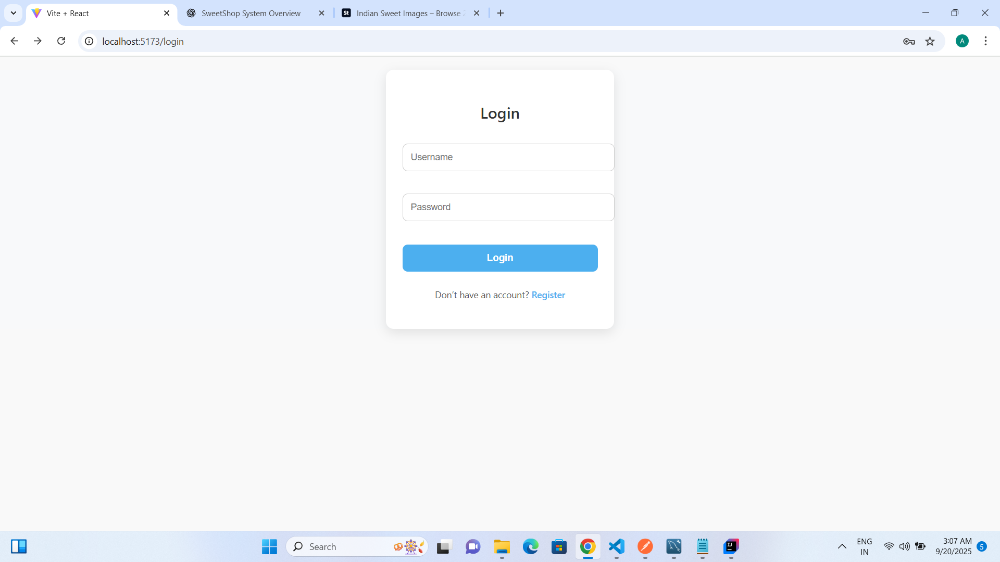
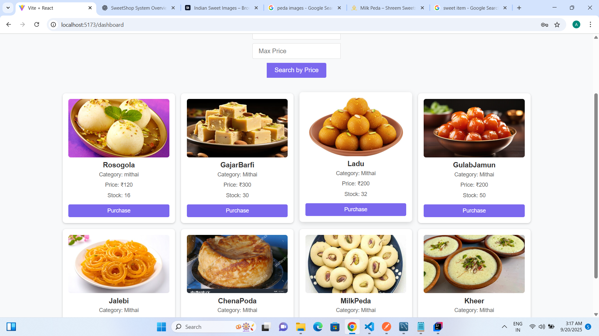
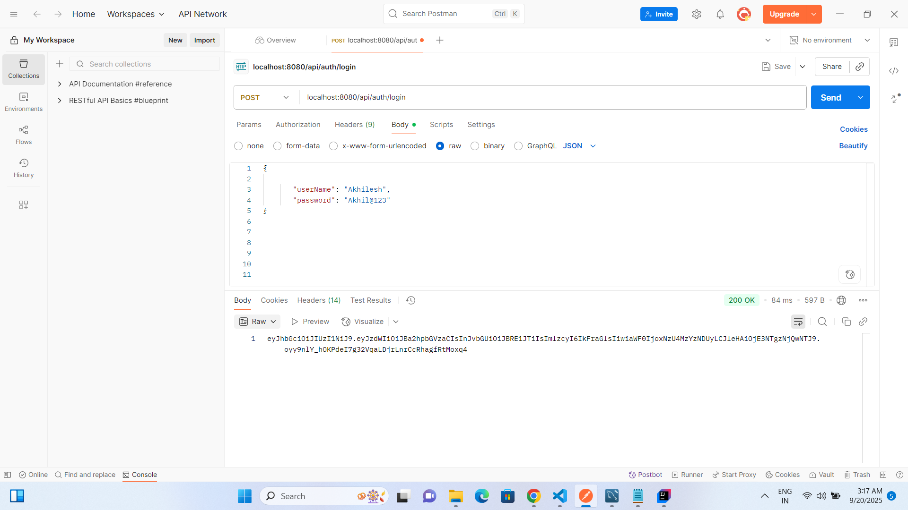
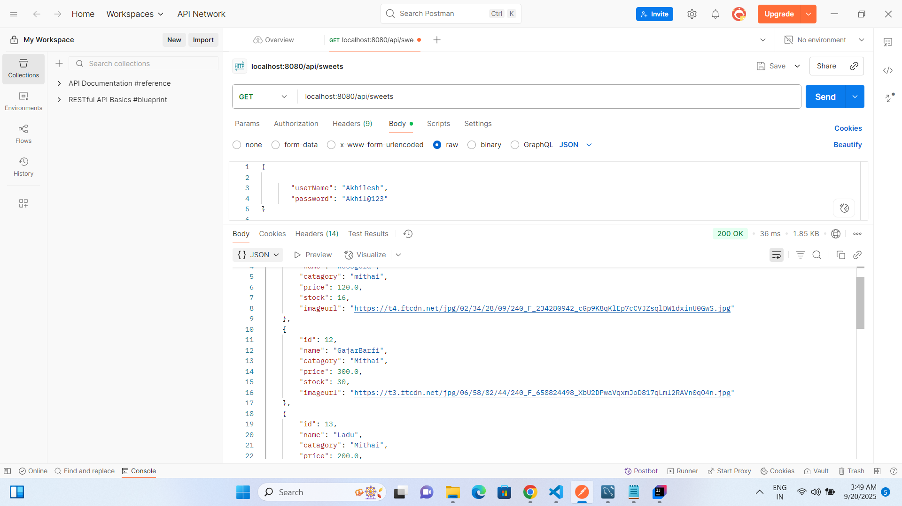
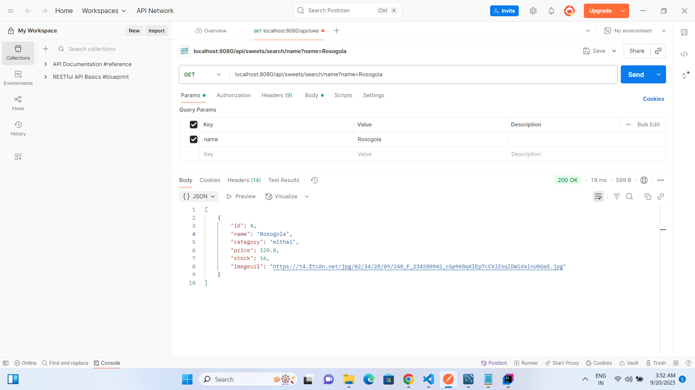
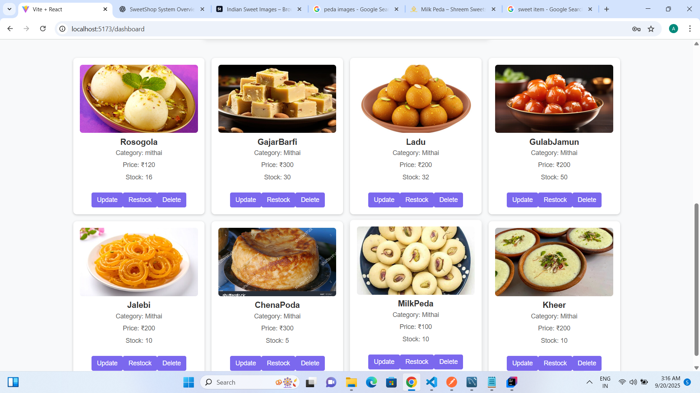

# SweetShop Management System

## Project Overview
**SweetShop Management System** is a complete full-stack application built to streamline sweet shop operations, including product management, orders, and inventory tracking.

- **Backend:** Developed with **Spring Boot**, providing secure RESTful APIs for CRUD operations.
- **Frontend:** Built with **React**, delivering a responsive and intuitive user interface for both customers and admins.

---

## Key Features
- **User Authentication (JWT):** Secure login and registration for multiple user roles.
- **Product Management & Purchase:**
    - Users can browse sweets, check stock availability, search by name, category, or price range, and make purchases.
- **Role-Based Access:**
    - **ADMIN:** Can add, update, restock, and delete sweets.
    - **USER:** Can browse and buy sweets but cannot modify product data.
- **Security:** All endpoints are protected using **Spring Security**, ensuring role-based access control.

---

## Backend Architecture
- Built using **Spring Boot** with a **layered architecture** for clarity and maintainability:
    - **Entity Layer:** Defines database tables and relationships.
    - **Controller Layer:** Handles incoming HTTP requests from the frontend.
    - **Service Layer:** Implements business logic such as purchases and stock management.
    - **Repository Layer:** Interacts with the database using Spring Data JPA.
    - **Configuration Layer:** Sets up Spring Security and JWT authentication.
    - **Exception Layer:** Centralizes custom exception handling.

*This layered design improves maintainability, testing, and scalability.*

---

## Frontend
- Developed using **React** and styled with simple, responsive CSS.
- **Key UI Components:**
    - Login and registration forms.
    - Product listing page with search and filter functionality.
    - Admin panel for product CRUD and restocking.
    - Logout option for all users.

*The UI is designed to be simple, clean, and easy to navigate.*

---

## Database
- **Database:** MySQL is used to store users, sweets, and purchase data.
- Connected to Spring Boot via **Spring Data JPA** using configured database URL, username, and password.
- Ensure the database is created before running the application:
```sql
CREATE DATABASE sweetshop;
```

---

## Tech Stack
- **Backend:** Spring Boot, Java  
- **Frontend:** React, CSS  
- **Database:** MySQL  
- **Authentication & Security:** JWT, Spring Security

---

## Screenshots

1. **Login Page**  
   

2. **User Purchase Page**  
   

3. **Postman API Testing - Login**  
   

4. **Postman API Testing - Get All Sweets**  
   

5. **Postman API Testing - Search by Name**  
   

6. **Admin Panel**  
   


---

## Setup Instructions

### Backend
1. Add the following dependencies in `pom.xml`:  
   - `spring-boot-starter-web`  
   - `spring-boot-starter-data-jpa`  
   - `spring-boot-starter-security`  
   - `mysql-connector-java`  
   - `Lombok`  
   - JWT dependencies
2. Run:
   ```bash
   mvn clean install

### Frontend
  -create a react vite project
  -npm install
  -npm run dev then application is running.

---

  ## My Ai Usage

 Debugging Assistance: Used ChatGPT to debug backend and frontend issues.

 Frontend Tools & UI Guidance: AI helped with component design, layout suggestions, and implementing charts.

 AI tools use: Chatgpt, Gemini

---

## Test Report

### Backend Testing (Postman)
- Used **Postman** to test all backend API endpoints.
- Verified endpoints work correctly:
    - **Login:** `POST /api/auth/login`
        - Screenshot: `./screenshots/PostManTestLogin.png`
    - **Get All Sweets:** `GET /api/sweets`
        - Screenshot: `./screenshots/PostManTestGetAll.png`
    - **Search Sweet by Name:** `GET /api/sweets/search/name?name=Rosogola`
        - Screenshot: `./screenshots/PostManTestSearchByName.png`
    - **Other endpoints** (register, add, update, purchase, restock) also work properly.

### Frontend Testing
- Verified frontend connects correctly to backend.
- **User View:** Displays all sweets and allows purchases.
    - Screenshot: `./screenshots/User.png`
- **Admin View:** Shows admin panel with add/update/delete/restock options.
    - Screenshot: `./screenshots/Admin.png`
- **Login Page:** Works for both user and admin roles.
    - Screenshot: `./screenshots/Login.png`  
